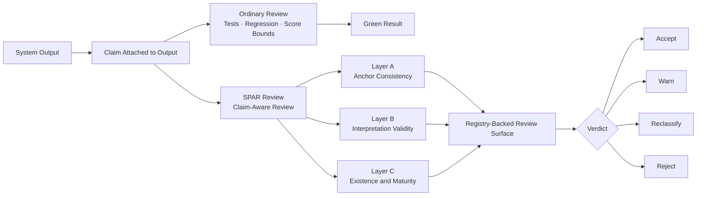

# spar-framework

[](https://www.python.org/downloads/)
[](https://github.com/flamehaven01/SPAR-Framework/actions/workflows/ci.yml)
[](https://github.com/flamehaven01/SPAR-Framework/releases)
[](https://github.com/flamehaven01/SPAR-Framework/tree/main/src/spar_domain_physics)

Claim-aware review for systems whose outputs can pass while their claims drift.

SPAR is the framework behind that review. It checks whether an output deserves
the claim attached to it, not just whether the system still produces a stable
result.

**SPAR is not a physics-only framework. Physics is where we proved it.**

The broader product is claim-aware review:

- outputs can stay green while implementation state changes underneath
- approximations can be reported as closure
- governance labels can drift out of sync with computation
- stable scores can carry unjustified confidence

SPAR does not promise truth. It prevents unjustified confidence.

Built in physics. Applicable anywhere outputs can pass while claims drift.

| Catch claim drift | Emit maturity state | Adopt in layers |
|---|---|---|
| Detect when green outputs and attached claims no longer match. | Keep `exact`, `approximate`, `partial`, `heuristic`, and `environment_conditional` visible at review time. | Start with lightweight claim checks, then grow into full Layer A/B/C review. |

---

**Navigation:**  
[Why This Matters](#why-this-matters) •
[Workflow](#workflow) •
[Why Teams Use It](#why-teams-use-it) •
[Where It Fits](#where-it-fits) •
[Adoption Path](#adoption-path) •
[What SPAR Provides](#what-spar-provides) •
[Quick Start](#quick-start) •
[Architecture](#architecture) •
[Repository Layout](#repository-layout) •
[Development](#development) •
[Changelog](CHANGELOG.md)

---

## Why This Matters

Most review systems stop at output correctness.

They ask:

- did the code run
- did the test pass
- did the score stay within bounds

SPAR asks a harder question:

- does the claim still deserve to stand

That distinction matters in real systems:

- a patch can pass tests while overstating completeness
- an analytics dashboard can stay green while the interpretation becomes stale
- a model score can remain reproducible while its maturity state changes
- a scientific result can stay numerically stable while the justification weakens

This is the gap SPAR is built to review.

## Workflow



Ordinary review asks whether the system still passes. SPAR asks whether the
claim deserves to survive that pass.

## Why Teams Use It

**Keep green outputs honest**  
When CI stays green but implementation and claim drift apart, SPAR gives teams
a review layer that can force a warning, downgrade, or reclassification before
false confidence becomes policy or product language.

**Attach maturity to results**  
SPAR keeps exact, approximate, partial, heuristic, and environment-conditional
states visible at review time. That matters for model governance, regulated
pipelines, scientific systems, and any workflow where reproducibility is not
enough.

**Adopt it in layers**  
Teams do not need the full framework on day one. A lightweight claim check, a
small maturity registry, and a full Layer A/B/C review path can be introduced
as separate maturity levels.

## Where It Fits

SPAR is not a generic linter, not a theorem prover, and not an LLM judge.

It is a deterministic review framework for one specific problem:

**checking whether outputs deserve the claims attached to them.**

That makes it useful above ordinary regression and below broad governance prose.
It gives teams a structured way to ask what a result is claiming, what
implementation state produced it, and what maturity state must travel with it.

## Adoption Path

Do not start with the full framework unless you already need it.

### Level 1 — Claim Check

Add three explicit review questions to an existing workflow:

- What is the output actually claiming?
- Does that claim match the implementation state?
- Is this result exact, approximate, partial, or heuristic?

This is the lightest entry point. Most teams can do this immediately.

### Level 2 — Maturity Labels

Add a simple registry and attach state labels to results:

- `heuristic`
- `partial`
- `closed`
- `environment_conditional`

This is already a meaningful step beyond ordinary review.

### Level 3 — Full SPAR

Use the full framework:

- Layer A — anchor consistency
- Layer B — interpretation validity
- Layer C — existence and maturity probes
- registry-backed snapshots
- explicit score and verdict policy

This repository currently exposes that full path for the first physics adapter.

## What SPAR Provides

**Generic review kernel**  
Explicit score and verdict policy for deterministic claim-aware review.

**Registry-backed runtime surface**  
Maturity and gap snapshots travel with the review result instead of living only
in prose.

**Adapter boundary for real domains**  
Layer A / B / C logic stays domain-owned. This repository already includes a
working physics adapter as the first proof case.

## What SPAR Does Not Provide

- a universal truth engine
- free-form LLM judging in the core
- TOE API/router integration inside the framework package
- domain contracts inside the generic kernel

## Quick Start

```bash
pip install -e .[dev]
```

```python
from spar_framework.engine import run_review
from spar_domain_physics.runtime import get_review_runtime

runtime = get_review_runtime()

result = run_review(
    runtime=runtime,
    subject={
        "beta_G_norm": 0.0,
        "beta_B_norm": 0.0,
        "beta_Phi_norm": 0.0,
        "sidrce_omega": 1.0,
        "eft_m_kk_gev": 1.0e16,
        "ricci_norm": 0.02,
    },
    source="flat minkowski",
    gate="PASS",
    report_text="Bounded report text.",
)

print(result.verdict)
print(result.score)
print(result.model_registry_snapshot["total_models"])
```

## Architecture

SPAR separates claim-aware review into three layers.

### Layer A — Anchor Consistency

Checks whether output agrees with a declared analytical or contractual anchor.

### Layer B — Interpretation Validity

Checks whether report language and declared scope stay within what the
implementation state justifies.

### Layer C — Existence and Maturity Probes

Checks what kind of implementation produced the result:

- genuine
- approximate
- gapped
- environment-conditional
- research-only

The core package stays domain-agnostic. Domain adapters provide anchors,
contracts, and maturity logic.

## Why Physics Comes First

Physics is the first adapter because it gives the framework a hard proof case.

It is where the distinction between:

- stable output
- justified claim
- declared maturity

can be made explicit enough to test rigorously.

That does **not** make SPAR physics-only.

It means the framework first proved itself in a domain where claim drift is
visible and costly.

## Repository Layout

- `src/spar_framework/`
  - generic review kernel
  - result types
  - scoring policy
  - registry model
- `src/spar_domain_physics/`
  - first domain adapter
  - registry seeds
  - analytical anchors
  - Layer A / B / C implementations
- `tests/`
- `docs/`
- `mica.yaml`
- `memory/`

## Start Here

1. `docs/ARCHITECTURE.md`
2. `docs/EXTRACTION_MAP.md`
3. `src/spar_framework/engine.py`
4. `src/spar_domain_physics/runtime.py`
5. `memory/spar-framework-playbook.v1.0.0.md`

## Development

```bash
python -m pytest -q
python -m build
```

## Status

Current state:

- standalone package scaffold complete
- generic kernel extracted
- first physics adapter extracted
- TOE integration already consuming the framework runtime

This means the project is no longer only an extraction target. It is already a
working standalone framework with one concrete domain adapter.
