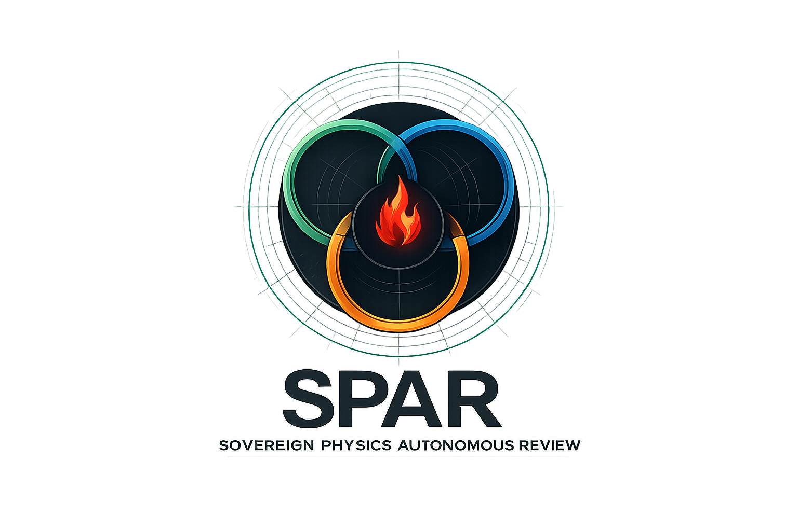
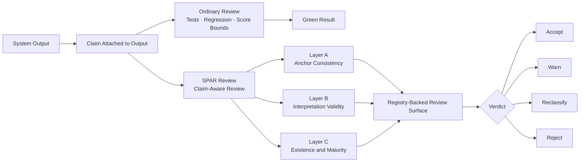

# SPAR Framework

<p align="center">
  
</p>

<p align="center">
  <strong>Claim-aware review for systems whose outputs can pass while their claims drift.</strong>
</p>

<p align="center">
  <a href="https://www.python.org/downloads/"></a>
  <a href="https://github.com/flamehaven01/SPAR-Framework/actions/workflows/ci.yml"></a>
  <a href="https://github.com/flamehaven01/SPAR-Framework/releases"></a>
  <a href="https://github.com/flamehaven01/SPAR-Framework/tree/main/src/spar_domain_physics"></a>
</p>

<p align="center">
  <a href="#why-spar-exists">Why SPAR Exists</a> •
  <a href="#quick-start">Quick Start</a> •
  <a href="#three-layer-structure">Architecture</a> •
  <a href="#where-it-fits">Where It Fits</a> •
  <a href="#adoption-path">Adoption Path</a> •
  <a href="#docs">Docs</a>
</p>

---

> **SPAR does not promise truth. It prevents unjustified confidence.**

SPAR (Sovereign Physics Autonomous Review) is a deterministic framework for **claim-aware review**: checking not whether a system still produces stable output, but whether that output deserves the interpretation attached to it.

**SPAR is not a physics-only framework. Physics is where we stress-tested it.**

```text
outputs can stay green  ->  while implementation state changes underneath
approximations          ->  can be reported as closure
governance labels       ->  can drift out of sync with computation
stable scores           ->  can carry unjustified confidence
```

| | What it does |
|---|---|
| **Catch claim drift** | Detect when green outputs and attached claims no longer match |
| **Emit maturity state** | Keep `exact`, `approximate`, `partial`, `heuristic`, and `environment_conditional` visible at review time |
| **Adopt in layers** | Start with lightweight claim checks, grow into full Layer A / B / C review |

---

## Why SPAR Exists

Most review systems answer one question:

> *Did the system still produce the expected output?*

SPAR is built for a harder one:

> *Does the output still deserve the claim attached to it?*

These are not the same question. A system can be reliable and inadmissible at the same time.

- A residual can stay numerically stable while the analytical justification weakens
- A computation path can become genuine while the registry still records a heuristic
- An approximation can be reported as closure
- A model can remain reproducible while its maturity state changes underneath it

This is the gap SPAR is built to review.

**Primary fit:** physics and mathematical model admissibility for PDE models, dynamical systems, inverse problems, constrained optimization, tensor or field models, and scientific ML surrogates.

**Secondary fit:** model governance, AI code review, regulated analytics, and reporting.

## Quick Start

```bash
pip install -e .[dev]
```

```python
from spar_framework.engine import run_review
from spar_domain_physics.runtime import get_review_runtime

runtime = get_review_runtime()

result = run_review(
    runtime=runtime,
    subject={
        "beta_G_norm": 0.0,
        "beta_B_norm": 0.0,
        "beta_Phi_norm": 0.0,
        "sidrce_omega": 1.0,
        "eft_m_kk_gev": 1.0e16,
        "ricci_norm": 0.02,
    },
    source="flat minkowski",
    gate="PASS",
    report_text="Bounded report text.",
)

print(result.verdict)                                 # ACCEPT / MINOR_REVISION / REJECT
print(result.score)                                   # 0-100 penalty-table score
print(result.model_registry_snapshot["total_models"]) # registry-backed maturity surface
```

**Contextual workflow** with MICA and optional LEDA:

```bash
spar review \
  --subject-json subject.json \
  --source "flat minkowski" \
  --gate PASS \
  --project-root /path/to/project \
  --leda-injection reports/leda_injection.yaml \
  --output-json review.json
```

`--project-root` triggers MICA auto-discovery using the v0.2.2 runtime detection order. If `mica.yaml` is present, SPAR records `INVOCATION_MODE`. If only a legacy archive exists, SPAR records `LEGACY_MODE`.

**AI-friendly CLI surface**

```bash
spar review    # run machine-readable review
spar explain   # summarize an existing review JSON
spar discover  # detect adapter + MICA runtime state
spar schema    # emit subject/result/context contracts
spar example   # emit example subject payloads
```

## Three-Layer Structure



### Layer A — Anchor Consistency

Checks whether output agrees with a declared analytical or contractual anchor, not just whether it stayed within regression bounds.

```text
CONSISTENT  ->  output agrees with the declared contract
ANOMALY     ->  output contradicts an established analytical expectation
```

### Layer B — Interpretation Validity

Checks whether report language and declared scope stay within what the implementation state justifies. This layer is deterministic: no free-form LLM judge.

Contextual physics checks:

- `B4` — LEDA claim-risk surface
- `B5` — MICA runtime state (`INVOCATION_MODE`, `LEGACY_MODE`, `INACTIVE`)

### Layer C — Existence and Maturity Probes

Checks what kind of implementation produced the result:

| State | Meaning |
|---|---|
| `genuine` | Real implementation of the claimed model |
| `approximate` | Known simplification with bounded error |
| `gapped` | Known missing piece, openly disclosed |
| `environment_conditional` | Depends on an external bridge not always present |
| `research_only` | Heuristic, not ready for governance use |

Contextual physics checks:

- `C9` — LEDA maturity alignment
- `C10` — MICA invariant continuity

## Scoring

SPAR uses an explicit penalty table. No hidden learned weights.

```python
SCORE_TABLE = {
    "ANOMALY":       -15,   # contradicts an analytical anchor
    "FAIL":          -10,   # review-layer failure
    "GAP":            -5,   # honest gap disclosure
    "WARN":           -3,   # bounded concern
    "APPROXIMATION":  -2,   # known simplification
}
```

**Verdict protocol**

| Score | Verdict |
|---|---|
| `>= 85` | `ACCEPT` |
| `>= 70` | `MINOR_REVISION` |
| `>= 50` | `MAJOR_REVISION` |
| `< 50` or `>= 2` Layer A anomalies | `REJECT` |

Two or more Layer A anomalies trigger unconditional `REJECT` regardless of total score.

## Where It Fits

SPAR is not a generic linter, not a theorem prover, and not an LLM judge.

It occupies a specific position:

**above ordinary regression, below broad governance prose.**

```text
Unit tests / regression  ->  does the system still behave as before?
SPAR                     ->  does the output deserve the claim attached to it?
Governance prose         ->  what is the organizational policy?
```

**What SPAR provides**

- Generic review kernel with explicit score and verdict policy
- Registry-backed maturity snapshots that travel with every result
- Adapter boundary: Layer A / B / C logic stays domain-owned
- Contextual tightening via MICA and LEDA in the physics adapter

**What SPAR does not provide**

- A universal truth engine
- Free-form LLM judging in the core
- Domain contracts inside the generic kernel
- TOE API or router integration inside the package

## Adoption Path

Do not start with the full framework unless you already need it.

### Level 1 — Claim Check

Add three explicit questions to any existing review:

1. What is this output actually claiming?
2. Does that claim match the implementation state?
3. Is this result exact, approximate, partial, or heuristic?

### Level 2 — Maturity Labels

Attach explicit state labels to results:

- `heuristic`
- `partial`
- `closed`
- `environment_conditional`

This is already a meaningful step beyond ordinary review.

### Level 3 — Full SPAR

- Layer A — anchor consistency
- Layer B — interpretation validity
- Layer C — existence and maturity probes
- Registry-backed snapshots
- Explicit score and verdict policy

## Contextual Output Example

```json
{
  "context_summary": {
    "sources": ["mica", "leda"],
    "mica": {
      "state": "INVOCATION_MODE",
      "mode": "memory_injection",
      "critical_invariants": 1
    },
    "leda": {
      "classification": "restricted",
      "claim_risk_count": 1,
      "suggested_maturity": "partial"
    }
  },
  "layer_b": [{ "check_id": "B5", "status": "PASS" }],
  "layer_c": [
    { "check_id": "C9", "status": "APPROXIMATION" },
    { "check_id": "C10", "status": "GENUINE" }
  ]
}
```

Legacy mode is intentionally weaker: `B5 = WARN`, `C10 = APPROXIMATION`.

## Why Physics Comes First

Physics is the first adapter because it provides a hard proof case: a domain where the distinction between stable output, justified claim, and declared maturity can be made explicit enough to test rigorously.

That does **not** make SPAR physics-only. It means the framework first proved itself in a domain where claim drift is visible and costly.

## Next Adapter

The next adapter should be a generic scientific-model adapter for:

- PDE and simulation pipelines
- Dynamical systems and control models
- Inverse and calibration models
- Constrained optimization models
- Scientific ML surrogates

See [docs/SCIENTIFIC_MODEL_ADAPTER.md](docs/SCIENTIFIC_MODEL_ADAPTER.md) for the draft direction.

## Docs

| Document | Description |
|---|---|
| [What Is SPAR](docs/WHAT_IS_SPAR.md) | Conceptual overview |
| [Admissibility](docs/ADMISSIBILITY.md) | The core distinction |
| [Physics as the Proof Case](docs/PHYSICS_PROOF_CASE.md) | Why physics comes first |
| [Use Cases](docs/USE_CASES.md) | Where and how to apply SPAR |
| [Scientific Model Adapter Draft](docs/SCIENTIFIC_MODEL_ADAPTER.md) | Next adapter direction |
| [CLI](docs/CLI.md) | AI-friendly command surface and exit-code contract |
| [LEDA Injection Contract](docs/LEDA_INJECTION_CONTRACT.md) | Integration contract |
| [MICA -> LEDA -> SPAR Workflow](docs/MICA_LEDA_SPAR_WORKFLOW.md) | Contextual workflow |
| [Security Model](docs/SECURITY_MODEL.md) | Security design |

**Start here**

```text
docs/WHAT_IS_SPAR.md
docs/ADMISSIBILITY.md
src/spar_framework/engine.py
src/spar_domain_physics/runtime.py
```

## Repository Layout

```text
src/
  spar_framework/
    engine.py
    scoring.py
    result_types.py
    registry.py
    context.py
    mica.py
    workflow.py
  spar_domain_physics/
    runtime.py
    layer_a.py
    layer_b.py
    layer_c.py
    matcher.py
    ground_truth_table.py
    registry_seed.py
tests/
docs/
mica.yaml
memory/
```

## Development

```bash
python -m pytest -q
python -m build
```

## Status

| Component | State |
|---|---|
| Standalone package scaffold | complete |
| Generic review kernel | extracted |
| Physics domain adapter | complete |
| TOE integration | consuming framework runtime |
| Scientific model adapter | in specification |

The project is no longer only an extraction target. It is a working standalone framework with one concrete domain adapter already consumed by an external system.

---

<p align="center">
  Built in physics. Applicable anywhere outputs can pass while claims drift.<br/>
  <a href="https://flamehaven.space/work/spar-framework/">flamehaven.space/work/spar-framework</a>
</p>
