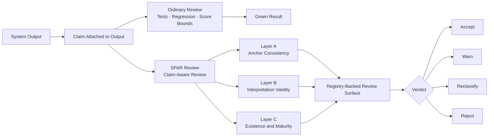

# spar-framework

[](https://www.python.org/downloads/)
[](https://github.com/flamehaven01/SPAR-Framework/actions/workflows/ci.yml)
[](https://github.com/flamehaven01/SPAR-Framework/releases)
[](https://github.com/flamehaven01/SPAR-Framework/tree/main/src/spar_domain_physics)

**Navigation:**  
[Workflow](#workflow) •
[Why Teams Use It](#why-teams-use-it) •
[Why This Matters](#why-this-matters) •
[Where It Fits](#where-it-fits) •
[Adoption Path](#adoption-path) •
[What SPAR Provides](#what-spar-provides) •
[Core Concept Docs](#core-concept-docs) •
[Quick Start](#quick-start) •
[Architecture](#architecture) •
[Repository Layout](#repository-layout) •
[Development](#development) •
[Changelog](CHANGELOG.md)

---

**SPAR (Sovereign Physics Autonomous Review)**

A deterministic adversarial review layer, first extracted from an open physics simulation and AI governance engine.

Claim-aware review for systems whose outputs can pass while their claims drift.

SPAR is the framework behind that review. It checks whether an output deserves
the claim attached to it, not just whether the system still produces a stable
result.

**SPAR is not a physics-only framework. Physics is where we proved it.**

The broader product is claim-aware review:

- outputs can stay green while implementation state changes underneath
- approximations can be reported as closure
- governance labels can drift out of sync with computation
- stable scores can carry unjustified confidence

SPAR does not promise truth. It prevents unjustified confidence.

Built in physics. Applicable anywhere outputs can pass while claims drift.

| Catch claim drift | Emit maturity state | Adopt in layers |
|---|---|---|
| Detect when green outputs and attached claims no longer match. | Keep `exact`, `approximate`, `partial`, `heuristic`, and `environment_conditional` visible at review time. | Start with lightweight claim checks, then grow into full Layer A/B/C review. |

---

**Primary fit:** physics and mathematical model admissibility review for PDE models, dynamical systems, inverse problems, constrained optimization models, tensor/field models, and scientific ML surrogates.

## Core Concept Docs

- [What Is SPAR](docs/WHAT_IS_SPAR.md)
- [Admissibility](docs/ADMISSIBILITY.md)
- [Physics as the Proof Case](docs/PHYSICS_PROOF_CASE.md)
- [Use Cases](docs/USE_CASES.md)

## Workflow



Ordinary review asks whether the system still passes. SPAR asks whether the
claim deserves to survive that pass.

---

## Why This Matters

SPAR is built first for **physics-grade and mathematical model review**.

That means systems where:

- numerical output can look stable
- analytical contracts matter
- maturity state changes what the result is allowed to claim
- a model can be exact, approximate, bounded, partial, or heuristic in ways that must remain visible

In those environments, ordinary review is too shallow. It usually asks:

- did the code run
- did the residual stay within bounds
- did regression remain green

SPAR asks a harder question:

- does this result still deserve the interpretation attached to it

That matters immediately for physical and mathematical model validation:

- a residual can stay numerically stable while the analytical justification weakens
- a computation path can become genuine while the registry still records a heuristic
- an approximation can be reported as closure
- a model can remain reproducible while its maturity state changes underneath it

The same review pattern then extends beyond physics:

- a patch can pass tests while overstating completeness
- an analytics dashboard can stay green while the interpretation becomes stale
- a model score can remain reproducible while its maturity state changes
- a scientific result can stay numerically stable while the attached claim becomes too strong

This is the gap SPAR is built to review.

## Why Teams Use It

**Validate mathematical model claims, not only outputs**  
SPAR is most useful when teams need to review physical, mathematical, or scientific models whose outputs can pass numerically while the surrounding claim has become too strong, too stale, or too vague.

Typical fits include:

- PDE and simulation models used in fluid, heat, reaction, wave, or field systems
- dynamical systems and control models where stability, boundedness, or convergence matters
- inverse and calibration models where parameter fitting does not automatically justify a stronger interpretation
- tensor, geometry, and field-theoretic models where exact, approximate, and heuristic paths must stay distinct
- scientific ML surrogates, PINNs, and hybrid models where prediction quality is not the same thing as admissible theory-level claim

**Keep analytical and implementation state synchronized**  
SPAR gives teams a review layer that can force a warning, downgrade, or reclassification when the model, registry, and outward-facing interpretation drift apart.

**Carry maturity labels with results**  
SPAR keeps `exact`, `approximate`, `partial`, `heuristic`, and `environment_conditional` states visible at review time. That matters in scientific computing first, and in other high-stakes review workflows second.

**Adopt it in layers**  
Teams do not need the full framework on day one. A lightweight claim check, a small maturity registry, and a full Layer A/B/C review path can be introduced as separate maturity levels.

## Where It Fits

SPAR is not a generic linter, not a theorem prover, and not an LLM judge.

It is a deterministic review framework for one specific problem:

**checking whether outputs deserve the claims attached to them.**

Its primary fit is:

- physics and mathematical model validation
- scientific computing pipelines
- research systems that need explicit admissibility or maturity surfaces
- model families such as PDE solvers, dynamical systems, inverse problems, constrained models, and scientific ML surrogates

Its secondary fit is:

- model governance
- AI code review
- regulated analytics and reporting

That makes it useful above ordinary regression and below broad governance prose. It gives teams a structured way to ask what a result is claiming, what implementation state produced it, and what maturity state must travel with it.

## Adoption Path

Do not start with the full framework unless you already need it.

### Level 1 — Claim Check

Add three explicit review questions to an existing workflow:

- What is the output actually claiming?
- Does that claim match the implementation state?
- Is this result exact, approximate, partial, or heuristic?

This is the lightest entry point. Most teams can do this immediately.

### Level 2 — Maturity Labels

Add a simple registry and attach state labels to results:

- `heuristic`
- `partial`
- `closed`
- `environment_conditional`

This is already a meaningful step beyond ordinary review.

### Level 3 — Full SPAR

Use the full framework:

- Layer A — anchor consistency
- Layer B — interpretation validity
- Layer C — existence and maturity probes
- registry-backed snapshots
- explicit score and verdict policy

This repository currently exposes that full path for the first physics adapter.

## What SPAR Provides

**Generic review kernel**  
Explicit score and verdict policy for deterministic claim-aware review.

**Registry-backed runtime surface**  
Maturity and gap snapshots travel with the review result instead of living only
in prose.

**Adapter boundary for real domains**  
Layer A / B / C logic stays domain-owned. This repository already includes a
working physics adapter as the first proof case.

## What SPAR Does Not Provide

- a universal truth engine
- free-form LLM judging in the core
- TOE API/router integration inside the framework package
- domain contracts inside the generic kernel

## Quick Start

```bash
pip install -e .[dev]
```

```python
from spar_framework.engine import run_review
from spar_domain_physics.runtime import get_review_runtime

runtime = get_review_runtime()

result = run_review(
    runtime=runtime,
    subject={
        "beta_G_norm": 0.0,
        "beta_B_norm": 0.0,
        "beta_Phi_norm": 0.0,
        "sidrce_omega": 1.0,
        "eft_m_kk_gev": 1.0e16,
        "ricci_norm": 0.02,
    },
    source="flat minkowski",
    gate="PASS",
    report_text="Bounded report text.",
)

print(result.verdict)
print(result.score)
print(result.model_registry_snapshot["total_models"])
```

## Architecture

SPAR separates claim-aware review into three layers.

### Layer A — Anchor Consistency

Checks whether output agrees with a declared analytical or contractual anchor.

### Layer B — Interpretation Validity

Checks whether report language and declared scope stay within what the
implementation state justifies.

### Layer C — Existence and Maturity Probes

Checks what kind of implementation produced the result:

- genuine
- approximate
- gapped
- environment-conditional
- research-only

The core package stays domain-agnostic. Domain adapters provide anchors,
contracts, and maturity logic.

## Why Physics Comes First

Physics is the first adapter because it gives the framework a hard proof case.

It is where the distinction between:

- stable output
- justified claim
- declared maturity

can be made explicit enough to test rigorously.

That does **not** make SPAR physics-only.

It means the framework first proved itself in a domain where claim drift is
visible and costly.

## Repository Layout

- `src/spar_framework/`
  - generic review kernel
  - result types
  - scoring policy
  - registry model
- `src/spar_domain_physics/`
  - first domain adapter
  - registry seeds
  - analytical anchors
  - Layer A / B / C implementations
- `tests/`
- `docs/`
- `mica.yaml`
- `memory/`

## Start Here

1. `docs/WHAT_IS_SPAR.md`
2. `docs/ADMISSIBILITY.md`
3. `docs/PHYSICS_PROOF_CASE.md`
4. `docs/ARCHITECTURE.md`
5. `src/spar_framework/engine.py`
6. `src/spar_domain_physics/runtime.py`
7. `memory/spar-framework-playbook.v1.0.0.md`

## Development

```bash
python -m pytest -q
python -m build
```

## Status

Current state:

- standalone package scaffold complete
- generic kernel extracted
- first physics adapter extracted
- TOE integration already consuming the framework runtime

This means the project is no longer only an extraction target. It is already a
working standalone framework with one concrete domain adapter.
